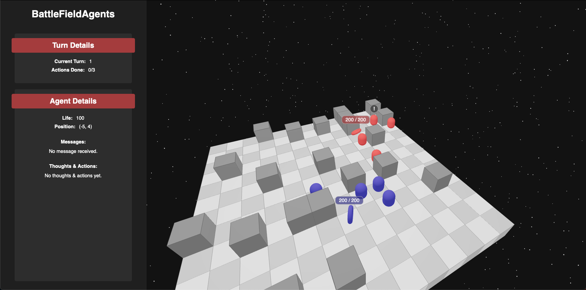

# BattleFieldAgents


BattleFieldAgents is a strategic video game project that utilizes OpenAI's GPT-4, a large language model (LLM), to control agents within the game. The agents are designed to make strategic decisions based on their surroundings, and can even explain their reasoning behind their actions. The ultimate goal of the project is to have these LLM Agents communicate and coordinate strategies with each other.



## Requirements

* [Python 3.10+](https://www.python.org/downloads/)
* [Node.js 16+](https://nodejs.org/en/download/)
* [An OpenAI API Key](https://beta.openai.com/)

Be carefull, the OpenAI API costs money to use. Each action taken by the agents will cost you money (about 0.01$).

## Installation & Setup

To get started with BattleFieldAgents, follow these steps:

### API (Python)

1. Go to the `api` directory:

```
cd api
```

2. Create a new virtual environment:

```
python -m venv venv
```

3. Activate the virtual environment:
```
source venv/bin/activate
```

4. Install the required Python packages:

```
pip install -r requirements.txt
```

5. Create a `.env` file in the root directory of the project, and add the following line:

```
OPENAI_API_KEY=your-api-key
```

6. Run the API:

```
python main.py
```

### Game (Node.js)

1. Go to the `game` directory:

```
cd game
```

2. Install the required Node.js packages:
```
npm install
```

3. Run the game:

```
npm start
```

4. The game will be running at `http://localhost:3000`. You can navigate to this URL in your browser to play the game.

## How to Play

You can press A to ask an agent to think about its next action. It will takes a few second, and the agent will answer with its reasoning, and will perform the actions he decided to do. An agent can move, shoot, and speak to another agent.  

To finish a whole game, you will have to press A multiple times until one team wins.

The game is not really meant to be play by humans. But for debugging purposes, you can control agents with the arrow keys and shoot with the space bar. The moves can only be 1 square at a time, and the shooting is on a random cell.

## Contribution
Feel free to make a pull request if you have any features you'd like to add, or any issues you've discovered. We welcome any contributions that can improve the game!

## License
This project is licensed under the MIT License with an Acknowledgment Clause. See LICENSE for more information.
